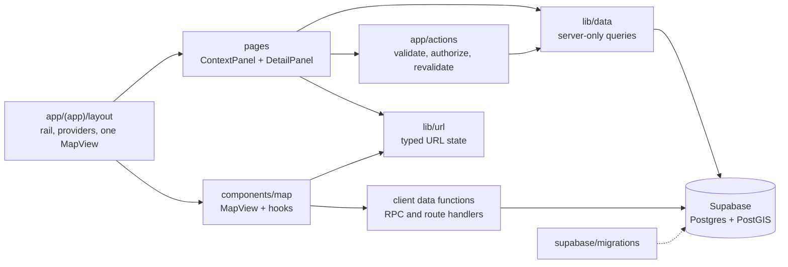

# SL Maps — target architecture

Where the refactor is heading. [AUDIT.md](AUDIT.md) says where the code is today; this file says where each piece should end up, what to call it, and which audit items are still open. If code and this file disagree, the code is the current state and this file is the destination.

## Overview



- The `(app)` layout owns the shell and the **only** map instance. Navigation never remounts it.
- Pages are Server Components that render a context panel and, optionally, a detail panel.
- Server reads go through `lib/data/`. Writes go through thin server actions, which call `lib/data/`.
- The map reads through a small set of client data functions (RPCs and route handlers), never ad hoc `supabase.from()` calls.
- All URL state goes through `lib/url/`.
- The schema lives in `supabase/migrations/`. The repo is the source of truth for the database.

## Folder layout

```text
app/
  (app)/                 signed-in routes; layout.tsx is the shell
    page.tsx             map: search and filters panels
    review/  categories/ one page each, panels only
  actions/               thin server actions: parse, authorize, call lib/data, revalidate
  api/                   route handlers
  sign-in/               outside the shell
components/
  shell/                 rail, ContextPanel, DetailPanel, ShellContext, shell constants
  map/                   MapView (composition only) and map UI
    hooks/               one hook per map concern
  categories/  review/   feature panels
  ui/                    feature-neutral primitives
lib/
  data/                  server-only query and mutation modules, one per entity
  supabase/              clients plus generated database.types.ts
  map/                   pure map helpers (styles, pins, geometry, layers)
  url/                   typed search-param helpers, one list of every param
  validation/            zod schemas shared by actions and route handlers
supabase/migrations/     schema baseline plus timestamped migrations
scripts/  tests/
docs/                    tracked: schema design, style guide, refactor/, performance.md
```

## Key decisions

| Area           | Today                                                                                                                                         | Target                                                                                                          |
| -------------- | --------------------------------------------------------------------------------------------------------------------------------------------- | --------------------------------------------------------------------------------------------------------------- |
| Schema         | Base schema in a sibling repo and the SQL editor; 6 hand-run files in `sql/`; live functions not in the repo                                  | `supabase/migrations/` with a baseline pulled from the live database, applied with the Supabase CLI             |
| Types          | Hand-written row types, `.returns<>()`, `as string` casts                                                                                     | Generated `database.types.ts`, typed clients                                                                    |
| Counts         | `MapPanels` and `CategoryList` page through every placemark 1,000 rows at a time (≈23 sequential requests at 22k rows); `MapPanels` reruns on every return to `/` | One aggregate RPC                                                                                               |
| Writes         | Placemark and tags written in several steps; tags deleted then reinserted; not atomic                                                         | One RPC per logical write, in a transaction                                                                     |
| Reads          | `supabase.from()` / `.rpc()` in 14 files, many in client effects; categories fetched in 5 places                                              | `lib/data/` on the server, a small set of client data functions                                                 |
| Map data       | Bbox RPC returns every placemark in view as jsonb on each `moveend` and every route change                                                    | Decided in phase 4.2 after measuring                                                                            |
| MapView        | One 984-line component, 17 refs, 9 effects; route awareness through `pathnameRef` and `routerRef`                                             | Composition only: a map-instance hook plus focused hooks driven by an explicit map mode                          |
| URL state      | Raw `pushState` in 7 files; the param list duplicated in `ShellContext`; `?id=` is a placemark on `/` and `/review` but a category on `/categories` | Typed helpers in `lib/url/`, one param registry, the `id` collision resolved                                    |
| Shell geometry | 768px breakpoint, 320px panel width and ⅔ detail height each exist as Tailwind classes and again as JS literals                               | One constants module feeding both                                                                               |
| Icons          | 5,437 committed JSON files (19 MB on disk) and a 98 kB name manifest in a client bundle                                                       | Decided in phase 4.4; nothing generated is committed                                                            |
| Tooling        | ESLint only                                                                                                                                   | Typecheck, Prettier, Vitest, CI, pre-commit hook                                                                |

## Glossary

| Term                  | Meaning                                                                                                                                                                                                  |
| --------------------- | -------------------------------------------------------------------------------------------------------------------------------------------------------------------------------------------------------- |
| **Shell**             | The persistent signed-in frame rendered by `app/(app)/layout.tsx`: rail, providers, map. It survives navigation between `/`, `/review` and `/categories`.                                                |
| **Rail**              | `AppRail`: the left icon column on desktop and the bottom tab bar on mobile. Picks the active context.                                                                                                     |
| **Context panel**     | `ContextPanel`: the scrolling list panel between the rail and the map (a bottom sheet on mobile). Every page renders exactly one.                                                                          |
| **Detail panel**      | `DetailPanel`: the panel over the bottom of the map that shows one item (placemark or category). Optional per page; while it is open the map pads its camera so pins stay visible above it.              |
| **Shell context**     | `ShellContext`: client state for which rail context is active (search, filters, review, categories) and whether the panel or sheet is open. Not to be confused with a React context in general.          |
| **Map mode**          | The single explicit value that tells the map what it is doing (for example browse, review, place, search). Hooks branch on the mode instead of on the pathname.                                           |
| **Placemark**         | The central entity: one real-world spot with a geometry, a category, tags and visits. A row in `placemarks`.                                                                                             |
| **Anchor**            | `placemarks.anchor`: a generated point (`ST_PointOnSurface(geom)`) used for pins, clustering and bbox queries, whatever shape `geom` has.                                                                 |
| **Review queue**      | The `/review` route: placemarks with `needs_review = true` (imported backlog), worked through one at a time with Save & next / Skip.                                                                     |
| **Data module**       | A server-only file in `lib/data/`, one per entity, holding that entity's queries and mutations. The only place server code talks to Supabase.                                                            |
| **Action result**     | The one return shape every server action uses: `{ ok: true, data }` or `{ ok: false, error }`, where `error` is a human-readable message. Actions don't throw for expected failures or redirect with `?error=`. |
| **Migration baseline**| The first file in `supabase/migrations/`: a dump of the live schema (tables, functions, triggers, policies, grants) taken once, so later migrations apply on top of a known state.                        |
| **PARKED**            | Code or schema that is deliberately unused today and must not be removed or migrated by the refactor. Listed at the end of this file.                                                                      |

## Conventions

Paths use the aliases `@app/*`, `@components/*`, `@lib/*` (or `@/*` for the repo root).

| Kind               | Goes in                                              | Naming                                                                                       | Notes                                                                                                                                                                       |
| ------------------ | ---------------------------------------------------- | -------------------------------------------------------------------------------------------- | --------------------------------------------------------------------------------------------------------------------------------------------------------------------------- |
| Page               | `app/(app)/<route>/page.tsx` (+ `loading.tsx`)       | Route segment in kebab-case: `review/`, `categories/`                                         | Server Component. Renders one context panel and an optional detail panel. Never renders a map. Pages outside the shell (like `sign-in`) sit outside `(app)`.                 |
| Panel              | `components/<feature>/`                              | `<Feature>List.tsx` for context-panel content, `<Feature>DetailPanel.tsx` for detail panels    | Wraps `ContextPanel` or `DetailPanel` from `components/shell/`. Server by default; client leaves only where there is interaction.                                            |
| Query (server)     | `lib/data/<entity>.ts`                               | Plural entity file (`placemarks.ts`, `categories.ts`); verb-first functions: `getPlacemarkDetails`, `listCategories`, `countPlacemarksByCategory` | Starts with `import 'server-only'`. Takes a Supabase client or creates one; returns typed rows from `database.types.ts`. Aggregation, filtering and sorting happen in SQL. |
| Query (client)     | `lib/data/client/<entity>.ts`                        | Same verb-first names; accept an `AbortSignal`                                                 | Only for data the map or other client-only UI must fetch after hydration. Each call is cancellable.                                                                         |
| Server action      | `app/actions/<entity>.ts`                            | Verb-first: `createPlacemark`, `savePlacemark`, `deleteCategory`                              | `'use server'`; exports only async functions. Parse with the zod schema, check the user, call `lib/data/`, revalidate narrowly, return an action result.                     |
| Route handler      | `app/api/<name>/route.ts`                            | kebab-case segment named for the resource                                                     | For GETs the client needs to cache or cancel (search). Validates params with the shared zod schema.                                                                         |
| Hook               | Next to its only consumer; shared map hooks in `components/map/hooks/` | `use<Thing>.ts`, one concern per hook (`useMapInstance`, `useCategoryPins`)               | No `'use client'` directive on hook modules; they inherit it from the importing component.                                                                                  |
| zod schema         | `lib/validation/<entity>.ts`                         | `<entity><Purpose>Schema`: `placemarkInputSchema`, `searchParamsSchema`; inferred type `type PlacemarkInput = z.infer<…>` | One schema per input shape, shared by the action and any route handler that takes the same input.                                                                           |
| URL param          | Registered in `lib/url/`                             | Short lowercase name, unique across all routes (no reusing `id` for two entities)              | Add it to the one param registry with its parser and serializer. Same-route changes use the `lib/url` push helpers (`history.pushState`); route changes use the router.     |
| Shell constant     | `components/shell/` constants module                 | `SCREAMING_SNAKE_CASE`                                                                       | Any size or breakpoint needed in both Tailwind and JS is defined once here.                                                                                                 |
| Migration          | `supabase/migrations/`                               | `<YYYYMMDDHHMMSS>_<snake_case_description>.sql` (Supabase CLI format)                         | Applied by the owner, never by an agent. Soft delete only, `owner_id` on every row, CHECK constraints instead of enums, sync columns intact, `set search_path` on every function, explicit grants. |

## Migration status

One row per REFACTOR, DUPLICATE and DEAD item in [AUDIT.md §0](AUDIT.md#0-inventory). Update the status as phases land: Not started → In progress → Done.

| Item                                                        | Label     | Audit issue                                                                        | Phase | Status      |
| ----------------------------------------------------------- | --------- | ---------------------------------------------------------------------------------- | ----- | ----------- |
| `app/(app)/layout.tsx`                                      | REFACTOR  | Duplicate `getUser()`; static `MapView` import puts mapbox-gl on every route        | TBD   | Not started |
| `app/(app)/review/page.tsx`                                 | REFACTOR  | Redirect to the first unsorted id costs a second round trip                         | TBD   | Not started |
| `app/(app)/review/loading.tsx`, `categories/loading.tsx`    | DUPLICATE | Identical panel skeletons                                                           | TBD   | Not started |
| `app/api/search/route.ts`                                   | REFACTOR  | `cat` unvalidated; unused `needs_review` param                                      | TBD   | Not started |
| `app/actions/categories.ts`                                 | REFACTOR  | Missing auth checks, not atomic, three error styles, sequential `uniqueSlug`        | TBD   | Not started |
| `app/actions/placemarks.ts`                                 | REFACTOR  | Not atomic, sequential tag find-or-create, broad `revalidatePath`                   | TBD   | Not started |
| `components/shell/ShellContext.tsx`                         | REFACTOR  | Repeats the param list and the 768px breakpoint                                     | TBD   | Not started |
| `components/shell/DetailPanel.tsx`                          | REFACTOR  | Stale `onClose` on Escape (confirmed bug)                                           | TBD   | Not started |
| `components/shell/AppShellSkeleton.tsx`                     | DUPLICATE | `PanelSkeletonBody` duplicates `PanelSkeleton`                                      | TBD   | Not started |
| `components/shell/PanelSkeleton.tsx`                        | REFACTOR  | Unneeded `'use client'`                                                             | TBD   | Not started |
| `components/map/MapView.tsx`                                | REFACTOR  | Too many responsibilities; duplicated parsing and shell geometry; stale category pins | TBD   | Not started |
| `MapView.tsx` `toPointGeometry`                             | DEAD      | Both live RPCs return a point `anchor`                                              | TBD   | Not started |
| `components/map/MapPanels.tsx`                              | DUPLICATE | Counts in JS by paging every placemark (same as `CategoryList`)                     | TBD   | Not started |
| `components/map/FilterPanel.tsx`                            | REFACTOR  | `useMatchCount` fires an exact count on every render                                | TBD   | Not started |
| `components/map/CategoryFilter.tsx`                         | DUPLICATE | Category tree building duplicates `CategoryList`                                    | TBD   | Not started |
| `components/map/useFilterParams.ts`                         | REFACTOR  | Should become the single URL schema; redundant `'use client'`                       | TBD   | Not started |
| `components/map/FilterTransitionContext.tsx`                | DUPLICATE | Same shape as `CategoryTransitionContext`                                           | TBD   | Not started |
| `components/map/SearchBox.tsx`                              | REFACTOR  | eslint-disable; hand-rolled debounce; geocode not abortable                         | TBD   | Not started |
| `components/map/SearchResultsContext.tsx`                   | REFACTOR  | Duplicated param parsing; runs on every route; unused export                        | TBD   | Not started |
| `components/map/DetailDrawer.tsx`                           | DUPLICATE | Details fetch duplicates `ReviewDetailPanel`; four hand-built pushStates            | TBD   | Not started |
| `components/map/PlacemarkForm.tsx`                          | REFACTOR  | Fetches categories on every mount; exports `inputClass`                             | TBD   | Not started |
| `components/map/AddPlacemarkToolbar.tsx`                    | DUPLICATE | `buttonClass` duplicated; offset tied to ZoomControl height                         | TBD   | Not started |
| `components/map/BasemapSwitcher.tsx`                        | DUPLICATE | Same `buttonClass`                                                                  | TBD   | Not started |
| `components/review/ReviewQueueContext.tsx`                  | REFACTOR  | 3 queries (2 exact counts) per load and per save; eslint-disable; page not in URL   | TBD   | Not started |
| `components/review/ReviewDetailPanel.tsx`                   | DUPLICATE | Details fetch duplicates `DetailDrawer`; same stale Escape                          | TBD   | Not started |
| `components/categories/CategoryList.tsx`                    | DUPLICATE | `getCategoryCounts` paging loop                                                     | TBD   | Not started |
| `components/categories/CategoryNavLink.tsx`                 | REFACTOR  | Unconditional `preventDefault` breaks modifier and middle clicks                    | TBD   | Not started |
| `components/categories/CategoryTransitionContext.tsx`       | DUPLICATE | Same shape as `FilterTransitionContext`                                             | TBD   | Not started |
| `components/categories/IconPicker.tsx`                      | REFACTOR  | 98.7 KB names JSON in the client; no fetch error handling                          | 4.4   | Not started |
| `components/ui/SubmitButton.tsx`                            | REFACTOR  | Unused `formAction` prop                                                            | TBD   | Not started |
| `lib/supabase.ts`                                           | DEAD      | No importers                                                                        | TBD   | Not started |
| `lib/map/markerIcons.ts`                                    | REFACTOR  | `'use client'` on a utility; `hasImage` blocks style updates                        | TBD   | Not started |
| `lib/map/hugeiconsNames.json`                               | REFACTOR  | Imported by a client component                                                      | 4.4   | Not started |
| `sql/0003_drop_want_to_go_index.sql`                        | REFACTOR  | Dropped the wrong index name (no-op)                                                | TBD   | Not started |
| `sql/0004_placemarks_geojson_review_scope.sql`              | REFACTOR  | Second overload, no limit, no `search_path`, unindexed `anchor` filter              | 4.2   | Not started |
| `sql/0006_placemarks_search.sql`                            | REFACTOR  | Duplicate blocks; second overload; no `search_path`                                 | TBD   | Not started |
| `package.json`                                              | REFACTOR  | Unused deps; no `engines`, `typecheck` or `test`                                    | TBD   | Not started |
| `next.config.ts`                                            | REFACTOR  | No security headers                                                                 | TBD   | Not started |
| `.gitignore`                                                | REFACTOR  | Ignores `docs/*`; Prisma skill dirs                                                 | 1.1   | Not started |
| `AGENTS.md` / `CLAUDE.md`                                   | REFACTOR  | Drift (audit §10)                                                                   | 0.2   | Done        |
| `README.md`                                                 | REFACTOR  | Drift (audit §10)                                                                   | 0.2   | Done        |
| `skills-lock.json`                                          | DEAD      | Locks Prisma skills; project doesn't use Prisma                                     | TBD   | Not started |
| `.agents/`, `.claude/`, `.windsurf/` skill dirs (untracked) | DEAD      | Prisma skills                                                                       | TBD   | Not started |
| `public/{file,globe,next,vercel,window}.svg`                | DEAD      | create-next-app leftovers, unreferenced                                             | TBD   | Not started |
| `public/hugeicons/*.json`                                   | REFACTOR  | 5,437 committed generated files                                                     | 4.4   | Not started |

### PARKED

Never migrated, refactored away or deleted. A phase may touch these only to keep them working.

| Item                                                                                                                                        | Where                                 |
| ------------------------------------------------------------------------------------------------------------------------------------------- | ------------------------------------- |
| `placemarks.want_to_go` and its index `idx_placemarks_want_to_go`                                                                           | Database                              |
| Light theme tokens `[data-theme="light"]` and `--map-a` / `--map-b`                                                                         | `app/globals.css`                     |
| Tables `collections`, `collection_items`, `media`, `placemark_conflicts`                                                                     | Database                              |
| Sync columns `revision` / `server_seq` and `sync_seq`                                                                                       | Database                              |
| RPCs `placemarks_near`, `placemarks_mvt`, `placemark_upsert`, `placemark_as_json`, `sync_pull`                                              | Database                              |
| `categories.attributes_schema` editing and `placemarks.attributes`                                                                          | `CategoryDetail.tsx`, database        |
